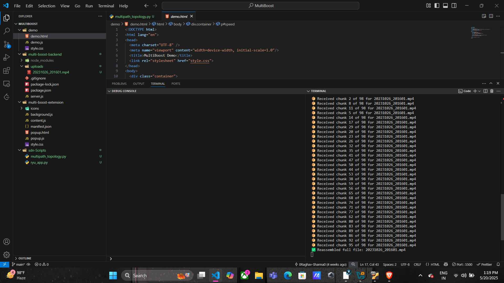
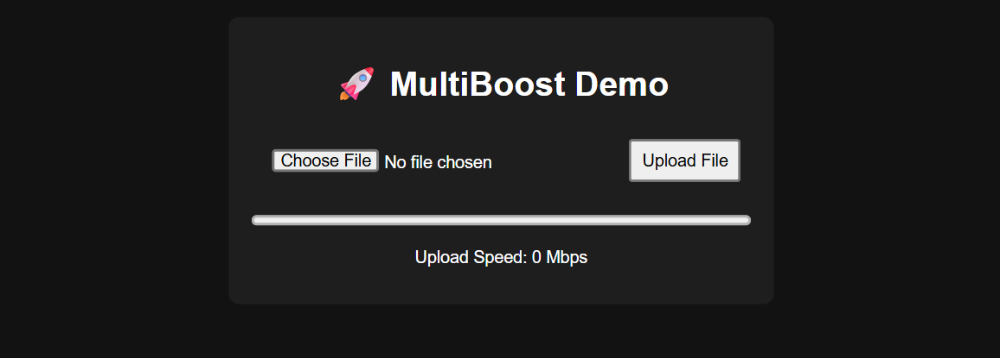
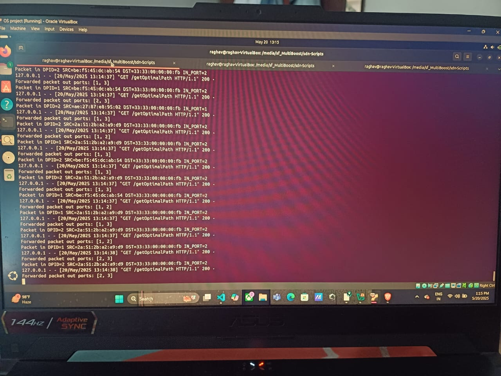
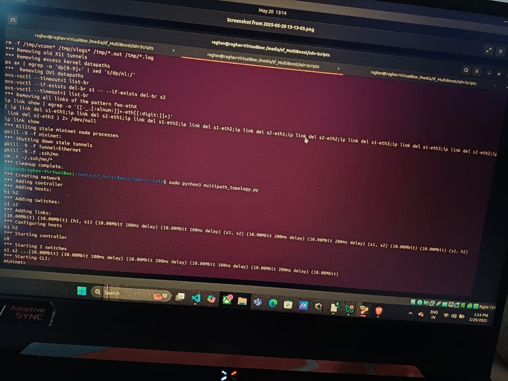

# 🚀 MultiBoosting - Advanced Multipath File Transfer

> ⚡ High-speed file uploads | 🧠 SDN Smart Routing | 📊 Real-time Monitoring | 🌐 Cross-platform

---

## ✨ Key Features
- 🔄 **Parallel File Chunking** — Split and upload large files faster
- 🧠 **SDN Integration** — Uses Ryu SDN controller for real-time route optimization
- 📈 **Real-Time Monitoring** — Track progress and performance instantly
- 💻 **Cross-Platform** — Works on Windows, Linux, and macOS

---

## 🛠️ Installation

```bash
git clone https://github.com/0Raghav-Sharma0/MultiBoosting.git
cd MultiBoosting
npm install
cd multi-boost-extension && npm install
```

---

## 🧪 How To Run

### 🚀 Start Backend
```bash
node server.js
```

### 🧠 Start SDN Controller
```bash
cd sdn-Scripts
ryu-manager ryu_app.py
```

### 🌐 Launch Interface
Open `demo.html` in your preferred browser

---

## 🧾 Project Structure

```
📁 /public/images           → All screenshot files  
📁 /multi-boost-backend     → Core Node.js backend  
📁 /multi-boost-extension   → Chrome extension  
📁 /sdn-Scripts             → Custom Ryu SDN controller + topology
```

---

## 🖼️ Screenshots

### 📄 Logs


### 💻 Interface


### 🧠 SDN Controller View


### 🌐 Network Topology


---

## ✅ Requirements

| Tool                | Version         |
|---------------------|-----------------|
| 🟩 Node.js           | 16+             |
| 🐍 Python            | 3.8+            |
| 🌐 Ryu SDN Controller | Latest stable   |
| 🌍 Browser           | Chrome/Firefox  |

---

## 🧩 Troubleshooting

- ❌ **Images not loading?** → Check image paths
- 🧩 **Extension not working?** → Inspect `manifest.json`
- 🧠 **SDN controller crash?** → View logs in terminal

---

## 📄 License
📝 MIT License — See [`LICENSE`](./LICENSE) for full terms.

---

## 💬 Support

Found a bug or have a feature request?  
Open an issue here 👉 [GitHub Issues](https://github.com/0Raghav-Sharma0/MultiBoosting/issues)

---

## 🙌 Credits

Made with ❤️ by [Raghav Sharma](https://github.com/0Raghav-Sharma0)  
IIIT Sonepat · Batch of 2023–2027

---

## 📢 Coming Soon (Ideas 💡)
- 📡 WebSocket-based upload progress updates  
- 🌐 Live bandwidth analysis  
- 📦 Cross-device sync and offline retry mechanism

---

```bash
🌟 Star the repo if you find it helpful!
```

